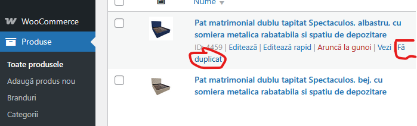
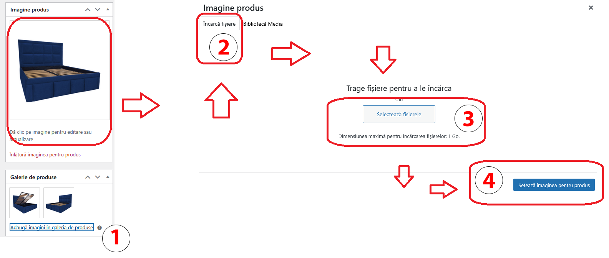

# MobilaUltra.ro
Documentatie pentru utilizatorii care administreaza eshop www.mobilaultra.ro. 
Informatii valabile doar pentru backend users.

---
## Cuprins pagina documentatie
- [Login pe site](#login) - cum ne conectam in backend
- [WooCommerce](#woocommerce) - modul pentru comenzi online
  - [Comenzi](#comenzi)
  - [Clienti](#clienti)
- [Produse](#produse)
  - [Categorii si subcategorii](#categorii-si-subcategorii-produse) - tip paturi (single/matrimonial), lazi, etc 
  - [Atribute](#atribute-produse) - culoare, dimensiuni, etc
  - [Branduri](#branduri) - nume colectie (Confort Plus, Spectaculos, Premium, etc)
- [Informatii administrare magazin](#info)
  - [Introducere produs nou prin copiere](#introducere-produs-nou-prin-copiere)

---
## Login

1. Acceseaza [https://mobilaultra.ro/admin](https://mobilaultra.ro/admin)
2. Introdu adresa de e-mail si parola contului tau.
3. Apasa pe **Login**.

Dacă ai uitat parola, folosește optiunea **Recupereaza parola** de pe pagina de login.

---

## WooCommerce
WooCommerce este add-onul platformei care activeaza eshop-ul nostru. 

### Comenzi
Aici se va scrie cum se procedeaza cu comenzile online: 
 - modificare status
 - procesare comanda
 - emitere factura fiscala (de vazut daca e posibil)

### Clienti

---
## Produse
Produsele pot fi adaugate din butonul **Adauga produs nou** aflat in panelul stanga al siteului.  
Insa, inainte de a introduce produsul, este necesar sa avem clar definite urmatoarele lucruri:
- imagini in format png (preferabil), clare si nepixelate
  - fundal alb
  - rezolutie patrata (800x800 px / 1000x1000 px / 1200x1200 px) - se recomanda 1000x1000 px
- atributele (vezi informatii mai jos)
- categorii si subcategorii (vezi informatii mai jos)
- descrierea

### Categorii si subcategorii produse

### Atribute produse

### Branduri

---

## Info
Instructiuni pas cu pas necesare promovarii produselor mobilaultra.ro. 

## Introducere produs nou prin copiere
Cea mai simpla solutie este sa clonam un produs anterior cand vine vorba de adaugarea unui pat nou, indiferent ca incercam sa adaugam o culoare noua sau chiar un produs nou. 
Motivul e simplu: prin clonarea produsului, acesta va porni deja cu mai multe atribute din produsul din care vom initia copierea: 
 - culoare
 - dimensiuni disponibile
 - tip pat
 - saltea inclusa
 - somiera inclusa
 - tip somiera
 - caracteristici cheie
 - structura
 - material tapiterie
 - spatiu depozitare
 - etc

Mai departe ramane sa il personalizam cu noul nume, permalinkul pentru optimizarea SEO, cateogriile & subcategoriile, descriere si preturi. 

Cum facem asta? Simplu, urmarim pasii urmatori: 
1. Mergi in secțiunea **Produse** din meniul de administrare.
2. Gaseste produsul pe care vrei sa-l copiezi.
3. Apasa pe butonul **Fa duplicat** din dreptul produsului.  
   
4. Se va genera un nou produs, cu aceleasi informatii.
5. Modifica urmatoarele campuri:
    - **Nume produs**
    - **Permalink** - click pe butonul **Editeaza** si copiaza numele produsului, urmand sa apesi **Ok**.  
    
    - **SKU / EAN** - **raman necompletate** - vor fi adaugate la variatii.
    - **Descriere** (daca este cazul)
    - **Imagini** (incarca imaginile noului produs)  
    
6. Modifica atributele produsului: 
    - Click pe **Atribute** aflat sub zona de descriere a produsului. 
    - Alege atributul pe care doresti sa il modifici (ex: Culoare).
    - Cauta valoarea dorita si adauga pe lista. 
    - Sterge valoarea anterioara. 
    - Scroll mai jos si apasa butonul **Salveaza atributele**.
    
7. Modifica variatiile produsului (de regula se regasesc variatii ale dimensiunilor (cm)):
    - Click pe **Variatii** aflat sub zona de descriere a produsului.
    
    - Se va face expand folosind **Editeaza** pe fiecare variatie.
    - Se vor introduce elementele:
      - SKU.
      - GTIN, UPC, EAN sau ISBN (copy/paste de la SKU).
      - Pret obisnuit (daca si unde e cazul).
    
    - Se va apasa pe butonul **Salveaza modificarile**.
    
8. Alege categoria si brandul corect regasite in panoul dreapta:  
   
   
8. Salveaza produsul nou prin efectuarea unui click pe butonul **Publica** aflat in partea dreapta sus.
   