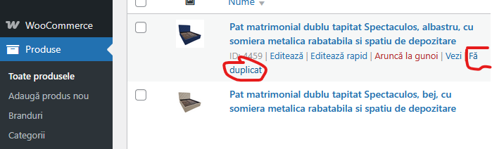

# 📦 Ghid utilizare platformă MobilaUltra.ro

**Ultima actualizare:** 2025-05-10  
**Autor:** Nume Prenume  

---

## 📌 Scop

Acest document oferă instrucțiuni clare pentru utilizatorii business ai platformei **MobilaUltra.ro**, privind gestionarea produselor și actualizarea prețurilor în platformă.

---

## 🔐 Login pe site

1. Accesează [https://mobilaultra.ro/admin](https://mobilaultra.ro/admin)
2. Introdu adresa de e-mail și parola contului tău.
3. Apasă pe **Login**.

Dacă ai uitat parola, folosește opțiunea **Recuperează parola** de pe pagina de login.

---

## 🆕 Introducere produs nou prin copierea unuia existent

1. Mergi în secțiunea **Produse** din meniul de administrare.
2. Găsește produsul pe care vrei să-l copiezi (ex: „Canapea Lira”).
3. Apasă pe butonul **Clonează** sau **Duplicați** din dreptul produsului.
4. Se va genera un nou produs, cu aceleași informații.
5. Modifică următoarele câmpuri:
   - **Nume produs**
   - **SKU / Cod unic**
   - **Preț**
   - **Descriere** (dacă este cazul)
   - **Imagini** (încarcă imaginile noului produs)
6. Salvează produsul nou.

📸 **Exemplu:**

---

## 🎨 Adăugare atribut nou (culoare nouă)

1. Din meniul de administrare, accesează secțiunea **Atribute**.
2. Selectează atributul **Culoare**.
3. Apasă pe butonul **Adaugă opțiune**.
4. Completează numele culorii (ex: „Verde Menta”).
5. (Opțional) Încarcă o mostră de imagine pentru noua culoare.
6. Salvează modificarea.

📸 **Exemplu:**

---

## 💸 Modificarea prețurilor prin export/import fișier

### Export prețuri:
1. Accesează secțiunea **Produse**.
2. Apasă pe butonul **Exportă**.
3. Selectează câmpurile dorite (minim: Nume, SKU, Preț).
4. Descarcă fișierul în format Excel sau CSV.

### Modificare:
1. Deschide fișierul în Excel.
2. Actualizează coloana **Preț** pentru produsele dorite.
3. Salvează fișierul.

### Import prețuri:
1. Mergi în secțiunea **Import** din platformă.
2. Încarcă fișierul modificat.
3. Asigură-te că mapezi corect câmpurile (SKU -> SKU, Preț -> Preț).
4. Apasă **Importă**.

📌 Notă: Sistemul identifică produsele pe baza **SKU-ului**, deci acesta nu trebuie modificat.

📸 **Exemplu mapping:**

---

## 📞 Suport

Pentru orice întrebări sau probleme, contactează:

- **Nume Prenume** — Administrator Platformă  
  📧 support@mobilaultra.ro  
  📞 0730 123 456  

---